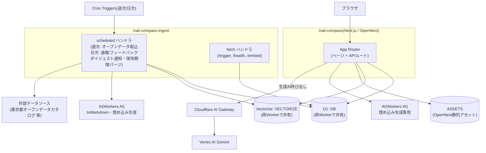
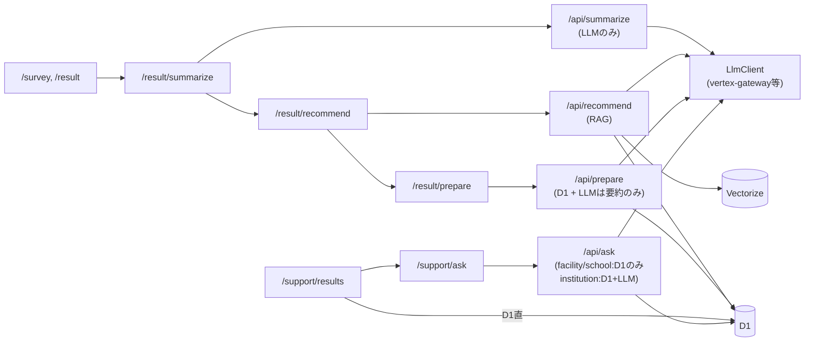

# Trait Compass アーキテクチャ概要(エンジニア向け)

## 1. 目的・対象読者

このページは、このリポジトリに新しく参加するエンジニア向けに、システム全体の構成を
俯瞰するためのものである。非エンジニア向けの説明は [`./technical-overview.md`](./technical-overview.md)
を参照する。データ取込パイプラインの詳細は [`./data-pipelines-for-engineers.md`](./data-pipelines-for-engineers.md)
に分けているので、そちらを参照する。

対象読者は、Next.js・Cloudflare Workers にひととおり触れたことがあるエンジニアを想定する。
個々のコンポーネントの使い方(wrangler の使い方、Next.js の基礎等)は説明しない。

## 2. モノレポ構成

npm workspaces によるモノレポである。

```
trait-compass/
  app/                 Next.js アプリ本体(Cloudflare Workers へ OpenNext 経由でデプロイ)
    src/app/           ルーティング(App Router、ページ・API Route)
    src/features/      機能ごとのドメインロジック(survey/support/recommend/ask-ai 等)
    src/lib/           横断的な基盤コード(ai/、api/、db/ 等)
    db/                D1 のスキーマ・マイグレーション・シード(schema.sql, migrations/, seed/)
  batch/               取込用 Cloudflare Worker + Node スクリプト群
    ingest/            取込 Worker 本体(オープンデータ取込・cron・fetch ハンドラ)
    scripts/           npm script として実行する Node ツール(手動調査データ投入 等)
  data/
    manual/            区市町村別の手動調査データ(YAML)。非公開リポジトリのみに存在する
    open-data/         オープンデータのソースレジストリ(sources.yaml 等)
    processed/         取込・加工済みデータの中間生成物
  docs/                本ドキュメントを含むドキュメント一式
```

`app/` と `batch/` はどちらも Cloudflare Workers 上で動くが、デプロイ単位(Worker)が異なる。
理由は次節で説明する。

## 3. 2つのWorker構成

このリポジトリは、1つの Next.js アプリに見えて実際には **2つの独立した Cloudflare Worker**
から構成される。

- `trait-compass`(`app/wrangler.toml`): OpenNext でビルドした Next.js アプリ本体。
  ユーザーがブラウザから直接アクセスする Worker。
- `trait-compass-ingest`(`batch/wrangler.ingest.toml`): オープンデータの定期取込と、
  管理系の定期処理(通報・フィードバックのダイジェスト通知、保持期限切れデータのパージ)を
  担う Worker。

2つに分かれている最大の理由は、**OpenNext(`@opennextjs/cloudflare`)が Cloudflare の
`scheduled` ハンドラ(cron トリガー)を扱えない**ことにある。定期実行が必要な処理は
Next.js アプリと同居できないため、素の Cloudflare Worker として別立てにしている。

両 Worker は D1(`DB`)と Vectorize(`VECTORIZE`)を共有する。取込 Worker 側で書き込んだ
データを、アプリ側がそのまま読み取る構成である。



アプリ側の生成AI呼び出しは Workers AI ではなく、**Cloudflare AI Gateway 経由の Vertex AI
Gemini**(BYOK)である。Workers AI バインディング(`AI`)がアプリ側にも存在するため紛らわしいが、
その用途は埋め込み生成のみであり、テキスト生成には使っていない。詳細は次節。

## 4. AIプロバイダ抽象化

生成AI・埋め込み・ベクトル検索は、いずれも本番実装とローカル開発用実装を差し替え可能な形で
抽象化してある(`app/src/lib/ai/`)。ローカル開発では、外部課金なしに一通りの機能をオフラインで
動かせることを重視した設計である。

- **LlmClient**(`llm-client.ts`): テキスト生成の抽象インターフェース。`LlmProvider` は
  `"mock" | "vertex-direct" | "vertex-gateway" | "gemini-mock-server"` の4種類。
  `createLlmClient()` が環境変数 `LLM_PROVIDER` で実装を切り替える(既定は `"mock"`)。
  本番は `"vertex-gateway"`(Cloudflare AI Gateway 経由の Vertex AI Gemini)を使う。
  実装は `app/src/lib/ai/providers/` 配下。
- **Embedder**(`embedder.ts`): 埋め込み生成の抽象インターフェース。`EmbedderProvider` は
  `"workers-ai" | "ollama"`。環境変数 `EMBEDDER_PROVIDER` で切り替える。本番は
  `"workers-ai"`(`@cf/baai/bge-m3`)。
- **VectorStore**(`vector-store.ts`): ベクトル検索の抽象インターフェース。`VectorStoreProvider`
  は `"vectorize" | "qdrant"`。環境変数 `VECTOR_PROVIDER` で切り替える。本番は `"vectorize"`。

ローカル開発は、`LLM_PROVIDER=mock`(または `gemini-mock-server`)+ `EMBEDDER_PROVIDER=ollama`
+ `VECTOR_PROVIDER=qdrant` の組み合わせにより、外部サービスに一切課金せず・接続せずに
一通りの機能を動かせる。詳細な手順は [`../usage/local-setup.md`](../usage/local-setup.md) を参照する。

Workers AI バインディング(`AI`)の実際の用途は次の2つに限られる。

1. 埋め込み生成(`workers-ai-embedder.ts`、モデル `@cf/baai/bge-m3`)。
2. 取込 Worker 側での XLSX → Markdown 正規化(`env.AI.toMarkdown`)。

テキスト生成(要約・説明文生成等)には使っていない。「`AI` バインディングがあるから
生成AIは Workers AI を使っている」という誤解をしやすい箇所なので、注意する。

## 5. ルーティングとAPI層

### ページルート

| グループ | パス |
| --- | --- |
| セルフチェック系 | `/survey`, `/result`, `/result/summarize`, `/result/recommend`, `/result/prepare` |
| 支援検索系 | `/support`, `/support/purpose`, `/support/results`, `/support/ask`, `/support/content-report`, `/support/facility-report` |
| 情報ページ系 | `/`, `/about`, `/beta-gate`, `/coverage`, `/data-sources`, `/guide`, `/help`, `/history`, `/outcomes`, `/privacy`, `/procedures-guide`, `/settings`, `/terms` |

### APIルート

| ルート | データストア/LLM利用 |
| --- | --- |
| `/api/ask` | `targetType` により3経路。`facility`/`school` は D1 の事実情報のみから決定的に回答を組み立て、LLMは使わない。`institution` は D1 の低リスクデータ(`risk_level='low'`)を根拠にLLMで生成する。 |
| `/api/recommend` | RAG構成。クエリを埋め込み化 → Vectorize 検索(`facility_id` のみ取得)→ D1 JOIN で事実情報を再取得 → LLMが「合いそうな理由」の短文のみを生成する。Vectorize 失敗時・0件時はD1のタグ検索へフォールバックする。危機シグナル検知時はAIを一切使わない。 |
| `/api/summarize` | LLMのみ(D1・Vectorizeは使わない)。危機シグナル検知時は定型文を返す。 |
| `/api/explain` | LLMのみ。根拠となる質問文データはコード内に保持している。 |
| `/api/prepare` | 窓口候補はD1検索。LLMは困りごと要約のみに使い、それ以外は決定的テンプレートで組み立てる。 |
| `/api/track` | D1 の `usage_counts` への集計カウンタ書き込みのみ。個人情報は扱わない。 |
| `/api/content-report`, `/api/facility-report`, `/api/feedback`, `/api/purpose-pickup`, `/api/beta-gate` | D1への書き込み・読み取りが中心(詳細は各 route.ts を参照)。 |

セルフチェックの結果画面から呼ばれる主要な流れを図にすると、次のようになる。



**fact-guard 方針**: 施設名・住所・連絡先・出典等の事実情報は、常にD1由来の値のみをレスポンスに
含める。LLMの生成テキストからこれらの事実情報を抽出・上書きする経路はどのAPIにも存在しない。
LLMが担うのは要約文・解説文・「合いそうな理由」といった付加的な自然文の生成のみである。

なお、セルフチェックの質問への回答・スコア集計はすべてクライアント側(ブラウザ)で完結し、
サーバーへは送信しない。これはプライバシー設計上の意図的な選択であり、詳細は
[`./technical-overview.md`](./technical-overview.md) を参照する。

## 6. 非公開要素

このリポジトリを公開する上で、以下は非公開とする。

- `app/wrangler.toml` / `batch/wrangler.ingest.toml` は、デプロイ環境の実識別子(D1データベースID、
  R2バケット名等)を含むため、公開リポジトリには含めない。バインディング構成そのもの
  (`DB`/`AI`/`VECTORIZE`/`ASSETS`/`RAW_BUCKET`/`INGEST_WORKFLOW` という名前と役割)は
  本ページで説明した通りだが、実際の設定ファイルは非公開である。
- `data/manual/`(区市町村別の手動調査実データ)は非公開である。データ構造・スキーマの概要は
  [`./data-pipelines-for-engineers.md`](./data-pipelines-for-engineers.md) で抽象的に説明する。
