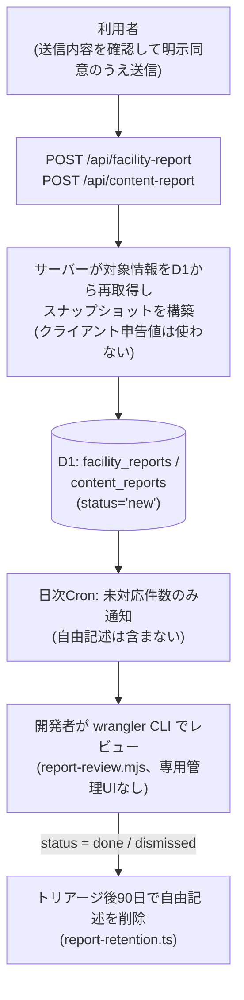

# データガバナンス(コードが持つ仕組み)

## 1. 目的

このページは、Trait Compass が掲載データの「出所・鮮度・ライセンス・訂正・品質」を
どのような**コード上の仕組み**で管理しているかを説明する。取込パイプラインの全体像は
[`./data-pipelines-for-engineers.md`](./data-pipelines-for-engineers.md) を、
システム構成は [`./architecture-for-engineers.md`](./architecture-for-engineers.md) を参照する。

## 2. データの出所と区分

すべての施設データは D1 の `datasets` テーブル(`app/db/schema.sql`)に紐づき、
`datasets` 行が出所メタ情報(`source_org`・`license`・`source_url`・`fetched_at`・
`is_alive`・`frozen`)を保持する。取込経路は3系統ある。

| 経路 | 定義場所 | `datasets` の識別 |
| --- | --- | --- |
| CKAN 自動取込(週次cron) | `batch/ingest/datasets.config.ts` | 定義済みの安定ID |
| ローカルオープンデータ取込 | `data/open-data/sources.yaml` + `batch/scripts/ingest-open-data.mjs` | manifest の `dataset_id` |
| 個別許諾データ(手動調査) | `batch/scripts/ingest-manual-survey.mjs` | `ds-<自治体コード>-manual-survey-programs`、`license = "manual-fact-verified"` |

学校系テーブル(`schools` 等)は行ごとに `sources_json` で出典を保持する。

**系統間の優先順位を判定する仕組みは存在しない。** 各経路の再取込は
自分のスコープ(手動調査は自治体コード単位、オープンデータはデータセットID単位)の
DELETE→INSERT で冪等に行われ、他系統の行を上書きしない(`buildSql()` を参照)。
唯一の例外的な補完として、`batch/scripts/enrich-school-addresses.mjs` が
文部科学省の学校コード一覧から住所を追記するが、これは**住所が未設定の学校のみ**が
対象で、手動調査で確認済みの値は変更しない。

## 3. 鮮度の管理

鮮度は `datasets.fetched_at`(取得日時)と `datasets.is_alive`(死活監視結果)を
起点に、以下の閾値で機械判定する(`app/src/features/support/services/dataset-status.ts`)。

- **オープンデータ**: `is_alive = 0`、または `fetched_at` から **30日** 超過
  (`STALE_THRESHOLD_DAYS`)で不健全と判定する。週次cronが `fetched_at` を進めるため、
  取込が止まらない限り超過しない。
- **個別許諾データ**: `fetched_at` は調査日のまま進まないため30日閾値の対象外とし、
  代わりに **365日** の有効期限(`MANUAL_DATA_VALID_DAYS`、
  `app/src/lib/manual-data-expiration.ts`)で判定する。

この判定はUIと監視の両方から同じ純関数で使われる。

- **UI(支援検索結果画面)**: 表示中のデータセットごとに「20XX/XX/XX時点の情報です」の
  注記を常時表示する(`app/src/features/support/components/DatasetFreshnessNote.tsx`、
  `fetched_at` 由来)。更新が終了したデータセット(`frozen = 1`)にはその旨を追記する。
  不健全と判定されたデータセットに属する分野は、広域(都全域)窓口のみの縮退表示へ
  切り替える(`app/src/features/support/services/facility-search.ts`)。
- **監視(取込 Worker の `GET /health`)**: `batch/ingest/index.ts` が全 `datasets` 行の
  `is_alive`・`fetched_at` を読み取り、経過日数・30日超過件数(`staleCount`)・
  不達件数(`deadCount`)を JSON で返す。UI側と同じ定数・純関数を import しており、
  判定基準が画面と監視で分岐しない。

## 4. ライセンス管理

CKAN 自動取込は `classifyLicense` でライセンス区分を判定し、開放ライセンス相当
(区分 A/F/G)以外は実データを取り込まずメタ情報のみ記録する。個別許諾データは
YAMLごとの許諾監査 `licenseAudit`(7状態)により、公開可能な状態のセクションだけを
D1へ投入する。詳細は
[`./data-pipelines-for-engineers.md`](./data-pipelines-for-engineers.md) の
「ライセンス許諾監査(licenseAudit)」を参照する。なお「掲載・出典表示してよいか」の
最終判定は `app/src/lib/dataset-visibility.ts` に集約されており、/data-sources と
/coverage の両画面が同じ基準を共有する。

## 5. 利用者からの訂正報告の流れ

掲載情報の誤りに気づいた利用者は、施設カード等から `/support/facility-report`
(施設情報)・`/support/content-report`(想定ルート・学校情報・ガイド)で報告できる。
報告種別(電話番号・住所・閉鎖・リンク切れ・情報が古い等)を選び、任意で
「正しいと思われる内容」(最大200字)と補足(最大500字)を自由記述できる。

設計上のポイントは次のとおりである。

- 保存するスナップショットは必ずサーバーが D1/ソースコードから再構築する
  (`app/src/app/api/facility-report/route.ts`・`app/src/app/api/content-report/route.ts`)。
  クライアントが偽装した「現在の掲載内容」を保存させない。
- 報告APIは GET を持たず、保存した報告を読み出す経路を一切提供しない。
- レート制限はIPアドレスを平文保存せず、SHA-256ハッシュ化したキーのみを短期保存する
  (`app/src/lib/reports/rate-limit.ts`)。
- トリアージ済み(`done`/`dismissed`)の報告は90日経過後にCronで削除される
  (`batch/ingest/report-retention.ts`)。未対応(`new`)の報告は削除しない。

## 6. 自治体データ追加時の品質チェック

個別許諾データ(1自治体=1 YAML)の追加・更新には、次の機械チェックが品質基準として働く。

1. **スキーマ検証CLI**(`batch/scripts/validate-manual.mjs`): 必須フィールド・enum値・
   出典必須(`sources` 1件以上)・自治体コードや日付の正規表現を検証する。
   使い方は [`../../batch/scripts/README.md`](../../batch/scripts/README.md) を参照する。
2. **PR時の自動実行**(`.github/workflows/validate-manual-data.yml`): 手動調査データや
   スキーマを変更するPRで上記CLIを自動実行し、第三者からのYAML提出も同じ基準で検証する。
3. **投入時の再検証**: `ingest-manual-survey.mjs` は投入直前にも検証を実行し、
   検証を通らないデータはD1へ到達しない。
4. **自治体コードの整合テスト**(`batch/scripts/__tests__/municipality-codes.test.ts`):
   TypeScript正本と batch 側ミラーの62区市町村コード表が完全一致することをパリティ
   テストで担保し、CI(`.github/workflows/ci.yml`)が全PRで実行する。

## 7. 本ドキュメントの範囲

本ページはリポジトリ内のコードが実装している仕組みのみを扱う。運用体制・対応スケジュール
等の内部運用は本リポジトリの範囲外である。ローカルでの再現手順は
[`../usage/local-setup.md`](../usage/local-setup.md) を参照する。
