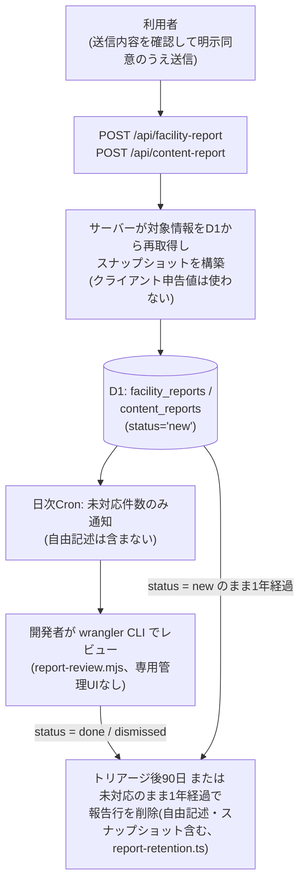

# データガバナンス(コードが持つ仕組み)

## 1. 目的

このページは、Trait Compass が掲載データの「出所・鮮度・ライセンス・訂正・品質」を
どのような**コード上の仕組み**で管理しているかを説明する。取込パイプラインの全体像は
[`./data-pipelines-for-engineers.md`](./data-pipelines-for-engineers.md) を、
システム構成は [`./architecture-for-engineers.md`](./architecture-for-engineers.md) を参照する。

## 2. データの出所と区分

すべての施設データは D1 の `datasets` テーブル(`app/db/schema.sql`)に紐づき、
`datasets` 行が出所メタ情報(`source_org`・`license`・`source_url`・`fetched_at`・
`is_alive`・`frozen`)を保持する。取込経路は3系統ある。

| 経路 | 定義場所 | `datasets` の識別 |
| --- | --- | --- |
| CKAN 自動取込(週次cron) | `batch/ingest/datasets.config.ts` | 定義済みの安定ID |
| ローカルオープンデータ取込 | `data/open-data/sources.yaml` + `batch/scripts/ingest-open-data.mjs` | manifest の `dataset_id` |
| 個別許諾データ(手動調査) | `batch/scripts/ingest-manual-survey.mjs` | `ds-<自治体コード>-manual-survey-programs`、`license = "manual-fact-verified"` |

学校系テーブル(`schools` 等)は行ごとに `sources_json` で出典を保持する。

**系統間の優先順位を判定する仕組みは存在しない。** 各経路の再取込は
自分のスコープ(手動調査は自治体コード単位、オープンデータはデータセットID単位)でのみ
冪等に行われ、他系統の行を上書きしない。具体的な実現方式は経路により異なり、個別許諾データ
(手動調査)は自治体コード単位の DELETE→INSERT(`buildSql()` を参照)、ローカルオープンデータ
取込は `facilities` 本体の UPSERT+事後差分クリーンアップである(詳細は次段落)。
唯一の例外的な補完として、`batch/scripts/enrich-school-addresses.mjs` が
文部科学省の学校コード一覧から住所を追記するが、これは**住所が未設定の学校のみ**が
対象で、手動調査で確認済みの値は変更しない。

**既知の制約(2026-08是正)**: `facility_tags`(相談分野タグ)は取込パイプラインのスコープ外
(意図的、上記いずれの経路も扱わない)のため、`app/db/seed/consultation-desk-tags*.sql` による
手動キュレーションのみが投入経路である。両スクリプトとも facilities の内容
(名称・分類・住所等)が変わらなければ id は安定している(`idFor()` の内容ハッシュ設計)ため、
id が変わらない再取込では `facility_tags` は失われない。ただし2つの経路で実現方式が異なる
(2026-08是正、外部コードレビュー指摘 項目4)。

- **個別許諾データ再投入(`batch/scripts/ingest-manual-survey.mjs`)**: 自治体単位で
  `facilities` を DELETE→INSERT する構成のまま(1回の `wrangler d1 execute --file` 実行が
  そのまま1トランザクションになるため非原子性の問題は無い)。削除前に該当施設の
  `facility_tags` を使い捨てのステージングテーブル(`_facility_tags_backup`、
  `CREATE TABLE ... AS SELECT` + 末尾 `DROP TABLE`)へ退避し、再投入後に**同じ id で
  復活した施設のみ**へ自動復元する。D1 は `CREATE TEMP TABLE` を許可しない(実機確認済み、
  `SQLITE_AUTH`)ため通常の `CREATE TABLE` を使い、前回実行が途中で失敗してステージング
  テーブルが残っている場合に備えて冒頭に `DROP TABLE IF EXISTS` を置いて自己修復する。
- **ローカルオープンデータ取込(`batch/scripts/ingest-open-data.mjs`)**: `facilities` 本体を
  `INSERT ... ON CONFLICT(id) DO UPDATE SET ...` の UPSERT 方式で投入する(旧 DELETE→INSERT
  構成は1データセットのSQLが1,000文単位でチャンク分割され、チャンクごとに別々のトランザクション
  として実行されるため非原子的だった、実機再現済み)。UPSERT方式では内容不変(=idが変わらない)
  facilityの`facility_tags`は一切削除されないため、退避・復元の仕組み自体が不要になった
  (旧`facility_tags_backup`永続テーブル、migration 0035、は本スクリプトではもう使われない。
  テーブル自体はスキーマから削除していない。理由は後述)。今回のバッチに含まれるfacility id
  一覧は、実際のUPSERTより先に永続マーカーテーブル`open_data_batch_ids`(migration 0037、
  [db-tables.md §29](./db-tables.md)参照)へ記録し、全UPSERTチャンク成功後の後始末でのみ参照する。
  配信元で削除されたfacility(今回のバッチに含まれなくなったid)のみ、後始末ステップ
  (`buildOrphanCleanupSql`、全UPSERTチャンク成功後にのみ実行)で`facility_tags`→`facilities`
  の順に削除する(削除前と同じidで復活する見込みが無い以上、退避する意味が無いため退避しない)。

id が変わった・施設自体が投入対象外になった(license-hold等)分のタグは、いずれの経路でも
復元されずそのまま破棄される(内容が変わった以上、タグの対応関係も再検証が必要なため
意図的に自動復元しない)。

**Vectorize 削除同期(2026-08是正、外部コードレビュー指摘 項目1)**: 上記いずれの経路で
`facilities` が削除された場合も、削除対象の facility_id は `pending_vector_deletions`
(outbox テーブル、migration 0036)へ記録される。本番の CKAN 取込 Worker
(`EMBEDDINGS_ENABLED=true`)の次回実行時に `runEmbeddingStep` がこの outbox を全件読み取り、
Vectorize から対応するベクトルを削除する(削除に失敗した分は outbox に残り、次回以降に
自動的にリトライされる自己修復設計)。

**migration 0036 適用前に取りこぼした過去分の残留ベクトル(2026-08是正、外部コードレビュー
指摘)**: outbox は migration 0036 適用**後**に削除された facility しか記録できないため、
それ以前に `facilities` から削除済みだった行のベクトルは outbox に一切現れず、Vectorize に
永久に残留する。Cloudflare Vectorize の Workers バインディングには ID 列挙 API が無く
(`describe`/`query`/`queryById`/`insert`/`upsert`/`deleteByIds`/`getByIds` のみ)、残留 ID を
コード側で特定して個別削除する reconcile 方式は採れない。そのため、**インデックス削除→
再作成→メタデータインデックス(municipality/age_range/lifestage_min/lifestage_max)再作成→
全 facility 再 embed**という一度限りの運用手順(runbook)で解消する設計とした。

1. 既存の Vectorize インデックスを削除する(`wrangler vectorize delete <index名>`)。
   破壊的操作でロールバック不可、メタデータインデックス設定も含めて消える。
2. 同じ次元数・メトリック(`src/lib/ai/embedder.ts` の `EMBEDDING_DIM` と一致させる)で
   インデックスを再作成する(`wrangler vectorize create <index名> --dimensions=<N> --metric=cosine`)。
3. municipality/age_range/lifestage_min/lifestage_max の4フィールド分のメタデータインデックスを、
   ベクトルの再 upsert(次の手順)より**前**に作成する(`wrangler vectorize create-metadata-index
   <index名> --property-name=<field> --type=<string|number>`)。インデックス作成前に upsert
   済みのベクトルはインデックス作成後もフィルタ対象にならないため、順序を守らないと同じ問題が
   再発する。
4. 全 facility の再 embed をトリガーする。`runEmbedPipeline`(`batch/ingest/embed-pipeline.ts`)
   は D1 の埋め込み対象を毎回**全件**取得して upsert する設計のため、CKAN 取込 Workflow を
   1回実行すれば全施設が入り直る(`EMBEDDINGS_ENABLED=true` が前提)。
5. 手順1(インデックス削除)から手順4(再 embed 完了)までの間、RAG のベクトル検索経路は
   インデックス不在によりエラーまたは0件となり、タグベース検索へ丸ごとフォールバックする
   (D1 のみで完結する経路は無影響)。トラフィックの少ない時間帯の実施を推奨する。
6. 再 embed 完了後、実際に自治体・年齢・ライフステージによる絞り込みが機能していることを
   動作確認する(フィルタ未機能時もエラーにはならずタグ検索相当の結果に静かに劣化するため、
   レスポンスの中身を確認する)。
7. 本 runbook は一度限りの過去分クリーンアップである。migration 0036 適用後に発生する削除は
   outbox の自己修復機構でカバーされるため、通常運用でインデックスの削除・再作成を繰り返す
   必要はない。

(実際のインデックス名・アカウント固有の運用手順は非公開の運用ドキュメントを参照)

なお、`facility_tags_backup`(migration 0035)テーブル自体は、上記の設計変更により
`ingest-open-data.mjs` からは参照されなくなった。他に参照箇所が無いため事実上未使用だが、
本チケットの範囲では(本番D1への書き込みが禁止されているため)スキーマからの削除は行わず、
将来のクリーンアップ候補として残している。

なお、この自動復元は「id が変わらない再取込」のみをカバーする。データセット自体を
まるごと入れ替える・タグ語彙を新規追加する等の場合は、引き続き
`npm run db:seed:local:tags-open-data`(本番は `db:seed:remote:tags-open-data`)を手動で
再実行する運用のままである。

## 3. 鮮度の管理

鮮度は `datasets.fetched_at`(取得日時)と `datasets.is_alive`(死活監視結果)を
起点に、以下の閾値で機械判定する(`app/src/features/support/services/dataset-status.ts`)。

- **オープンデータ**: `is_alive = 0`、または `fetched_at` から **30日** 超過
  (`STALE_THRESHOLD_DAYS`)で不健全と判定する。週次cronが `fetched_at` を進めるため、
  取込が止まらない限り超過しない。
- **個別許諾データ**: `fetched_at` は調査日のまま進まないため30日閾値の対象外とし、
  代わりに **365日** の有効期限(`MANUAL_DATA_VALID_DAYS`、
  `app/src/lib/manual-data-expiration.ts`)で判定する。365日は個別調査データの
  **最大**有効期間であり、正確性を365日間保証するものではない。電話番号・学級編制・
  相談窓口の情報は期限内でも変わりうるため、利用者からの訂正報告(§5)や公式URLの
  再確認によって期限内でも随時更新する。

この判定はUIと監視の両方から同じ純関数で使われる。

- **UI(支援検索結果画面)**: 表示中のデータセットごとに「20XX/XX/XX時点の情報です」の
  注記を常時表示する(`app/src/features/support/components/DatasetFreshnessNote.tsx`、
  `fetched_at` 由来)。更新が終了したデータセット(`frozen = 1`)にはその旨を追記する。
  不健全と判定されたデータセットに属する分野は、広域(都全域)窓口のみの縮退表示へ
  切り替える(`app/src/features/support/services/facility-search.ts`)。
- **監視(取込 Worker の `GET /health`)**: `batch/ingest/index.ts`(集計本体は
  `batch/ingest/health.ts`)が全 `datasets` 行の `is_alive`・`fetched_at`・`license`・
  `frozen`・`ckan_package_id` を、UIと同じ `evaluateDatasetStatus` に通して読み取り、
  経過日数・不健全件数(`staleCount`)・不達件数(`deadCount`)・意図的な監視対象外件数
  (`unmonitoredCount`)を JSON で返す。`frozen = 1` または(手動調査データ以外で)
  `ckan_package_id IS NULL` のデータセットは `is_alive = 0` でも取得失敗ではないため
  `deadCount` に含めない(`dataset-status.ts` の "frozen-or-unmonitored" 区分、2026-08是正)。
  `staleCount` は、オープンデータの30日超過(`kind: "open-data-unhealthy"`)に加えて、
  手動調査データの有効期限365日超過(`kind: "manual-expired"`)も合算する(外部コード
  レビューP1是正、2026-08)。UI側と同じ定数・純関数を import しており、判定基準が画面と
  監視で分岐しない。

## 4. ライセンス管理

CKAN 自動取込は `classifyLicense` でライセンス区分を判定し、開放ライセンス相当
(区分 A/F/G)以外は実データを取り込まずメタ情報のみ記録する。個別許諾データは
YAMLごとの許諾監査 `licenseAudit`(7状態)により、公開可能な状態のセクションだけを
D1へ投入する。詳細は
[`./data-pipelines-for-engineers.md`](./data-pipelines-for-engineers.md) の
「ライセンス許諾監査(licenseAudit)」を参照する。なお「掲載・出典表示してよいか」の
最終判定は `app/src/lib/dataset-visibility.ts` に集約されており、/data-sources と
/coverage の両画面が同じ基準を共有する。

## 5. 利用者からの訂正報告の流れ

掲載情報の誤りに気づいた利用者は、施設カード等から `/support/facility-report`
(施設情報)・`/support/content-report`(想定ルート・学校情報・ガイド)で報告できる。
報告種別(電話番号・住所・閉鎖・リンク切れ・情報が古い等)を選び、任意で
「正しいと思われる内容」(最大200字)と補足(最大500字)を自由記述できる。

設計上のポイントは次のとおりである。

- 保存するスナップショットは必ずサーバーが D1/ソースコードから再構築する
  (`app/src/app/api/facility-report/route.ts`・`app/src/app/api/content-report/route.ts`)。
  クライアントが偽装した「現在の掲載内容」を保存させない。
- 報告APIは GET を持たず、保存した報告を読み出す経路を一切提供しない。
- レート制限はIPアドレスを平文保存せず、SHA-256ハッシュ化したキーのみを短期保存する
  (`app/src/lib/reports/rate-limit.ts`)。
- トリアージ済み(`done`/`dismissed`)の報告は90日経過後、未対応(`new`)の報告への対応期限の
  SLAは定めていないが([`./operations-policy.md`](./operations-policy.md)参照)受付から1年
  (365日)を超えた場合、それぞれCronで**報告行ごと**削除される(`batch/ingest/report-retention.ts`)。
  `corrected_value`/`detail_text`(自由記述)のみを空にするのではなく、スナップショットJSON等を
  含む行全体を `DELETE` する。

## 6. 自治体データ追加時の品質チェック

個別許諾データ(1自治体=1 YAML)の追加・更新には、次の機械チェックが品質基準として働く。

1. **スキーマ検証CLI**(`batch/scripts/validate-manual.mjs`): 必須フィールド・enum値・
   出典必須(`sources` 1件以上)・自治体コードや日付の正規表現を検証する。
   使い方は [`../../batch/scripts/README.md`](../../batch/scripts/README.md) を参照する。
2. **PR時の自動実行**(`.github/workflows/validate-manual-data.yml`): 手動調査データや
   スキーマを変更するPRで上記CLIを自動実行し、第三者からのYAML提出も同じ基準で検証する。
3. **投入時の再検証**: `ingest-manual-survey.mjs` は投入直前にも検証を実行し、
   検証を通らないデータはD1へ到達しない。
4. **自治体コードの整合テスト**(`batch/scripts/__tests__/municipality-codes.test.ts`):
   TypeScript正本と batch 側ミラーの62区市町村コード表が完全一致することをパリティ
   テストで担保し、CI(`.github/workflows/ci.yml`)が全PRで実行する。

## 7. 本ドキュメントの範囲

本ページはリポジトリ内のコードが実装している仕組みのみを扱う。それを誰がどのくらいの
頻度で回すかという運用体制は [`./operations-policy.md`](./operations-policy.md) を参照する。
ローカルでの再現手順は [`../usage/local-setup.md`](../usage/local-setup.md) を参照する。
