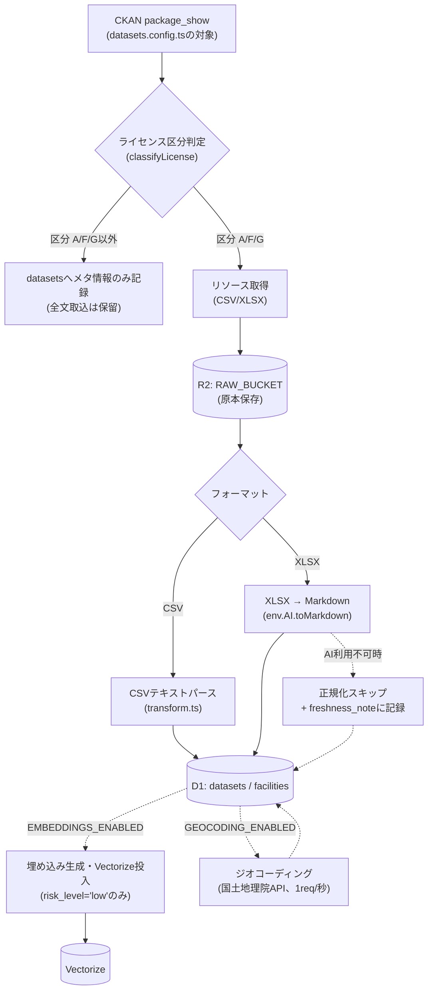
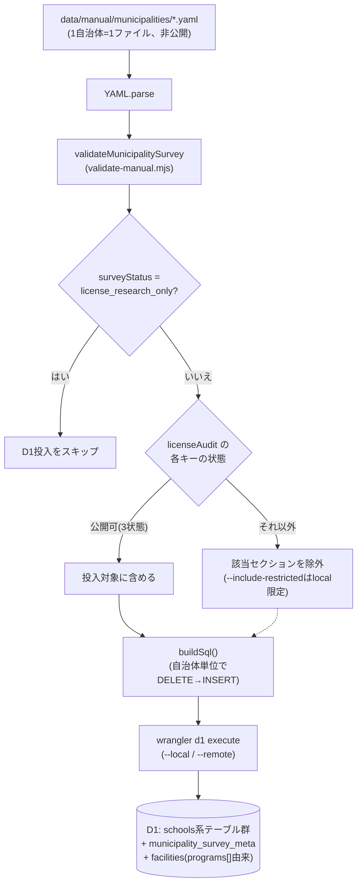

# データ取込パイプライン概要(エンジニア向け)

## 1. 目的

このページは、Trait Compass がどのように施設・学校情報をD1へ取り込んでいるかを説明する。
システム全体の構成(Worker構成・AI抽象化・ルーティング)は
[`./architecture-for-engineers.md`](./architecture-for-engineers.md) を先に参照する。

## 2. 2系統の概観

データ取込は、性質の異なる2系統から成る。

| 系統 | 対象データ | トリガー | 実装場所 |
| --- | --- | --- | --- |
| 自動オープンデータ取込 | 東京都オープンデータカタログ(CKAN)等の公開データ | 週次cron(手動発火も可) | `batch/ingest/`(`trait-compass-ingest` Worker) |
| 手動調査データ投入 | 区市町村別に人手で調査したYAML(学校・相談窓口等) | 開発者が手動でnpm scriptを実行 | `batch/scripts/ingest-manual-survey.mjs` |

両系統とも最終的に同じD1データベース(`DB`)へ書き込む。ただし対象テーブルは異なり、
オープンデータは主に `datasets`/`facilities` へ、手動調査データは学校系テーブル群と
`facilities`(YAML内の `programs[]` のみ)へ書き込む。

## 3. オープンデータ自動取込

`trait-compass-ingest` Worker の `IngestWorkflow`(`batch/ingest/workflow.ts`)が、
データセットごとに次の手順で処理する。

1. CKAN `package_show` でメタ情報を取得する(`ckan.ts`、対象データセット一覧は
   `datasets.config.ts`)。
2. ライセンス区分を判定する(`classifyLicense`、区分は A〜H)。区分 A(CC BY 4.0)・
   F/G(政府標準利用規約相当)以外は低リスクとみなさず、この時点で処理を止め、
   `datasets` へメタ情報のみを記録する(全文取込は保留)。
3. 区分 A/F/G のデータセットのみ、リソース(CSV/XLSXファイル本体)を取得する。
4. 取得した原本を、そのままR2バケット(`RAW_BUCKET`)へ保存する。
5. フォーマットに応じて正規化する。CSVはテキストパース(`transform.ts`)、XLSXは
   Workers AI の `toMarkdown`(`env.AI.toMarkdown`)で整形する。AIバインディングが
   利用できない場合は正規化をスキップし、その旨を `freshness_note` に記録するフォールバックへ倒す。
6. 正規化結果を `datasets`/`facilities` へUPSERTする(`db.ts`)。

全データセットの処理後、以下の2つの後段ステップが続く。いずれも既定は無効で、
環境変数で個別に有効化する。

- 埋め込み生成・Vectorize投入(`EMBEDDINGS_ENABLED`、`embed-pipeline.ts`)。対象は
  `risk_level='low'` の施設のみ。Vectorizeに保存するメタデータは `facility_id` と
  `municipality` のみに絞っている。
- ジオコーディング(`GEOCODING_ENABLED`、国土地理院APIを1リクエスト/秒でスロットルして呼び出す)。
  住所はあるが緯度経度が未設定の施設が対象。

R2バケット・Vectorizeインデックスの実際の名前は非公開のため、ここでは
「R2バケット」「Vectorizeインデックス」とだけ表記している。

## 4. 手動調査データ取込

区市町村ごとに人手で調査した相談窓口・学校情報は、`data/manual/municipalities/*.yaml`
(1自治体につき1ファイル)として保持している。このYAML自体は非公開リポジトリのみに存在し、
公開リポジトリには含まれない。スキーマの正本は `data/manual/schema/municipality.schema.ts`
(Zodスキーマ)であり、構造・検証ルールはコードとして公開される。

投入は開発者が手動で `batch/scripts/ingest-manual-survey.mjs` を実行して行う。流れは
次のとおりである。

1. YAMLを読み込みパースする。
2. `batch/scripts/validate-manual.mjs` の `validateMunicipalitySurvey` で検証する。
   ただし `surveyStatus === "license_research_only"`(著作権リスク調査のみ実施した
   骨組みファイル)の場合は、この後のD1投入自体をスキップする。
3. ライセンス許諾監査(`licenseAudit`)の状態に応じて、セクションごとに投入可否を判定する
   (詳細は次項)。
4. 判定結果に基づき、自治体単位のDELETE→INSERTからなる冪等なSQLバッチを生成する(`buildSql()`)。
5. `wrangler d1 execute`(`--local` または `--remote`)でD1へ投入する。

投入先のテーブルは `schools`, `school_fixed_classes`, `school_resource_rooms`,
`high_school_pathways`, `class_organizations`, `special_needs_schools`,
`support_pathways`, `support_pathway_steps`, `results_guide_notes`,
`municipality_survey_meta` のほか、YAML内の `programs[]` は `facilities`/`datasets`
へ変換される(これによりオープンデータ由来の施設と同じ検索・RAGロジックに乗る)。
学校情報(schools系テーブル)は `facilities` には入らない。

### ライセンス許諾監査(licenseAudit)

`licenseAudit` は1ファイルにつき4つのキー(`schoolClassData`, `consultationWindowData`,
`zoningData`, `highSchoolData`)を持ち、それぞれ次の7状態のいずれかを取る。

| 状態 | 意味 | 投入可否 |
| --- | --- | --- |
| `ccby_replaced` | CC BY等の代替公式データへ差し替え完了 | 可 |
| `ccby_available` | 代替CC BYデータの存在は確認済みだが差し替え未実施(自治体サイト転記のまま) | 不可 |
| `permission_pending` | 自治体への掲載許諾を申請中または未申請 | 不可 |
| `permission_granted` | 自治体から許諾取得済み | 可 |
| `permission_denied` | 許諾拒否(恒久)。解消には代替データへの差し替えが必要 | 不可 |
| `tokyo_restricted` | 東京都保有データで、利用条件により申請せず除外(恒久) | 不可 |
| `not_applicable` | 対象データがこのファイルに存在しない | 可 |

投入可能な3状態(`ccby_replaced`, `permission_granted`, `not_applicable`)以外は、
そのセクションのデータをD1へ投入しない。ローカル環境限定で `--include-restricted`
フラグを付けると除外を無視して投入できるが、`--remote` との併用は許可されていない。
なお、4状態値そのもの(`license_audit_json`)は、投入可否に関わらず常にメタ情報として
`municipality_survey_meta` に記録される。

## 5. ローカル実行

ローカルでの取込 Worker・D1・オフラインAIスタック(Ollama/Qdrant)のセットアップ手順は
[`../usage/local-setup.md`](../usage/local-setup.md) を参照する。
