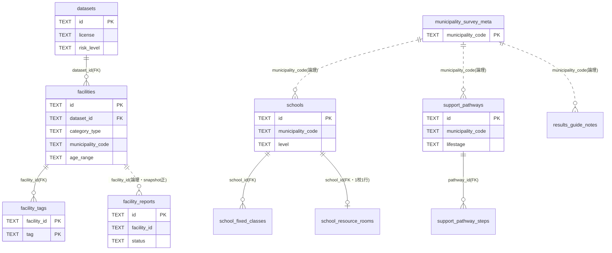

# DB 概要(最初に読む1枚)

## 1. 目的

このページは、新規参画者が最初に読むことを想定した D1(SQLite)データベースの俯瞰図である。
正本は [`app/db/schema.sql`](../../app/db/schema.sql) であり、全テーブル・全カラムの正確な定義は
[`./db-tables.md`](./db-tables.md) に委ねる。ここでは「どんなテーブル群があり、どう繋がっているか」
だけを短く掴めるようにする。システム全体の構成は [`./architecture-for-engineers.md`](./architecture-for-engineers.md)、
データがどう投入されるかは [`./data-pipelines-for-engineers.md`](./data-pipelines-for-engineers.md) を参照する。

## 2. ER図(コアテーブル)

スキーマ上の宣言的な外部キー(`REFERENCES`)は実線で示す。破線は **論理参照** であり、
FK制約は張らず、取込スクリプト・検索クエリ側の JOIN キー(`municipality_code` 等)や
スナップショット運用としてのみ成立している関係である(理由は各テーブルの説明を参照)。

図から省いたテーブル: 手動調査系の `high_school_pathways` / `class_organizations` /
`special_needs_schools` は `schools` と同様に `municipality_code` でのみ論理的に紐づく独立
テーブル、`school_registry` はどのテーブルとも意図的に疎結合、`content_reports` は
`facility_reports` の姉妹テーブル、残りは FK関係を持たない集計・レート制限カウンタである。

## 3. コアテーブルの役割

### datasets
取込データセット単位のメタ情報。出典・ライセンス区分(`license`)・リスク区分(`risk_level`:
low は全文表示可、medium/high はタイトル・要約+外部リンクのみ)・取得日時・死活監視フラグ
(`is_alive`)・更新終了フラグ(`frozen`)を持つ。取込 Worker が 1 データセット = 1 行として
UPSERT する。

### facilities
相談窓口・支援制度・福祉ガイド・発達障害支援資料の実体で、検索機能の中心テーブル。
`category_type`(4分類タブ)× `age_range` × 区市町村で検索する。`municipality` は表示用で、
検索・UPSERT・JOIN のキーは `municipality_code`(JISコード5桁、広域窓口は `'13000'`)である。
`is_medical` / `is_out_of_scope` による除外フラグ、`lat`/`lng`(ジオコーディング結果)、
`no_diagnosis_ok`(手動シードのみで投入)等の表示制御列を持つ。

### facility_tags
facilities × 相談分野タグの中間テーブル(複合主キー `facility_id, tag`)。スキーマ上 `tag` は
自由文字列だが、運用上は `SUPPORT_TAGS` の6値のみを投入する。

### schools(+ school_fixed_classes / school_resource_rooms)
手動調査した小学校・中学校の基本情報。固定級(特別支援学級)は障害種別ごとに複数持てるため
`school_fixed_classes`(1対多)、特別支援教室(通級相当)・拠点校情報は 1校1行の
`school_resource_rooms`(1対0..1)へ分離している。いずれも `school_id` の宣言FKで `schools` に
紐づく。同じ手動調査系の `high_school_pathways` / `class_organizations` /
`special_needs_schools` は学校単位の親子関係を持たないため、`schools` へのFKは張らず自治体
単位の独立テーブルとしている。

### municipality_survey_meta
自治体調査の基準日・人口・ハザード情報等のメタ(自治体1件=1行、`municipality_code` が主キー)。
手動調査系テーブル群と自治体コードで論理的に紐づき、ライセンス許諾監査の4データ区分
(各区分の判定値は7状態、`license_audit_json`)を画面の注記表示用に保持する。

### support_pathways(+ support_pathway_steps)
ライフステージ×目的別の「想定ルート」。`municipality_code` / `lifestage` / `purpose_id` で
一意に引けるよう、対象ライフステージごとに1行へ展開して持つ。順序付きステップは
`support_pathway_steps` に分離し、`pathway_id` の宣言FKで紐づく。

### school_registry
オープンデータ由来の学校一覧を保持する突合用テーブル。手動調査の `schools` 系(自治体単位で
DELETE→INSERT の洗い替え)とは意図的にFKで結ばず疎結合とし、突合は `school_code` や
名前+自治体で行う想定である。

### usage_counts
プライバシー配慮の集計型アナリティクス。date × screen の到達回数カウンタのみを持ち、
IP・User-Agent・時刻・その他ペイロードは一切保存しない。行レベル記録を持たない同方針の
集計テーブルとして `feedback_rating_counts` / `feedback_unclear_reason_counts` がある。

### レート制限テーブル群(*_rate_limits)
`ai_rate_limits` / `report_rate_limits` / `beta_gate_rate_limits` / `track_rate_limits` /
`feedback_rate_limits` の5つ。用途ごとの利用枠が競合しないよう意図的に別テーブルとし、
スキーマは全て同形(`client_key`, `window_start`, `count`)。`client_key` は IP そのものではなく
ウィンドウごとに変わる SHA-256 ハッシュで、行を跨いだ同一クライアント追跡は構造的にできない。

### facility_reports / content_reports
掲載情報の誤り報告。施設向けが `facility_reports`、施設以外(想定ルート・学校情報・ガイド)向けが
`content_reports` で、対象種別ごとにスナップショットの形が大きく異なるため別テーブルとする。
再取込で対象IDが変わり得るため参照整合(FK)は張らず、送信時点のスナップショットJSONを正とする。
専用の管理UIは持たず、開発者が wrangler CLI で `status` を手動更新する。

### feedback_comments
支援先一覧画面等のフィードバックのうち、唯一自由記述文そのものを行レベルで保持するテーブル
(公開許可 `publish_consent`・公開フラグ `published`・レビュー済みフラグ `dismissed` 付き)。
`created_date` は日付のみで、IPアドレス・User-Agent 等の識別子は保存しない。

## 4. さらに詳しく

全テーブル・全カラムの正確な定義(型・制約・migration 由来)と、スキーマとドキュメントの
乖離を機械的に検査する整合性テスト
([`db-docs-sync.test.ts`](../../app/src/lib/__tests__/db-docs-sync.test.ts))については
[`./db-tables.md`](./db-tables.md) を参照する。
