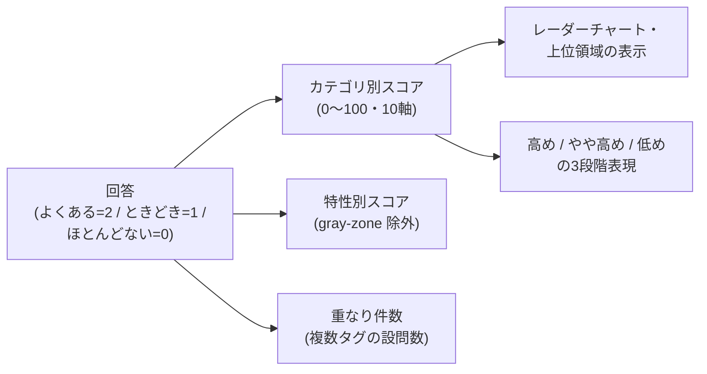

# セルフチェックの設計と根拠(方法論)

このページは、Trait Compass のセルフチェック(生きづらさアンケート)が
「どんな設問で・どう点数を計算し・どこまでのことが言えるのか」を説明するものです。
[technical-overview.md](./technical-overview.md) より少しだけ技術寄りですが、
エンジニア以外の方にも読めるように書いています。

大前提として、このセルフチェックは**医学的な診断ではありません**。
傾向を知り、必要なら相談につなげるための「目安」を作る道具です(詳しくは後半の章で説明します)。

## 1. 設問の構成と出典

- 設問プールは全 **242問**、**10カテゴリ**(領域)に分かれています。
- 実際のチェックでは、そのうち **30問**(各カテゴリの先頭3問)を**固定の順番**で出題します。
  ランダム抽出やシャッフルは行わないため、誰がいつ受けても同じ設問・同じ順番です。
- この30問は、242問から統計的な代表性を保証して選抜したサンプルではありません。
  「全10カテゴリを均等に(3問ずつ)扱う、回答時間を抑えたMVP向けの固定サブセット」
  という位置づけです(コード上もこの範囲を `P0` と呼んでいます)。将来この30問を
  見直す場合は、「他の設問との意味の重複が少ないか」「平易に読めるか」「体験として
  具体的か」「特定の年齢層に偏っていないか」「複数カテゴリにまたがりすぎていないか」
  といった観点を選定基準にする想定ですが、現時点でこれらの基準に基づく再選定は行って
  いません。
- 回答は「よくある(2点)/ときどきある(1点)/ほとんどない(0点)」の**3件法**です。
  尋ねるのは体験の**頻度のみ**で、「困っているかどうか」は設問には混ぜていません
  (頻繁にあるが困っていない/まれだが困るときは深刻、という人が答えに迷わないようにするためです)。

設問の出典について、正直に書きます。

- 設問は、ASRS や AQ のような**既存の臨床尺度・スクリーニング尺度からの引用・翻案ではありません**。
- 開発者が別途、事実確認(ファクトチェック)を行いながら整理してきた
  「発達特性のある人の日常の体験談」データ242件をもとに、
  本アプリ用に「よくある/ときどき/ほとんどない」で答えられる体験文へ**独自に書き直したもの**です。
- 書き直しの際は「中学生でも読める平易な語彙」「1問につき1つの体験(ダブルバーレル回避)」
  「設問文に『ASD』『過敏』などのラベル語・医学用語を入れない」という方針を置いています。
- したがって、この設問セットには**臨床的な妥当性検証(標準化)はありません**。
  この限界は「結果から言えること・言えないこと」の章で改めて述べます。

## 2. 各カテゴリ(軸)の定義

結果のレーダーチャートに出る10の軸は、次のように定義しています。

| 軸(カテゴリ) | 何を振り返る領域か |
|---|---|
| 会話・伝え方 | 話すタイミング、言葉の受け取り方、声の調子の調整など |
| 場の空気・人の気持ち | 表情・しぐさ・暗黙のルールなど、言葉にされない情報の受け取り方 |
| 感情の調整 | 情動の反応の強さ・持続を自分で調整すること |
| 衝動・記憶 | 衝動をとっさに抑えること、少し前のことを覚えておくこと |
| 段取り・実行 | 計画・開始・実行・完了・切り替え(いわゆる実行機能) |
| 善意が誤解される | 親切のつもりの言動が、相手には失礼・重いなどと誤解されること |
| 感覚 | 感覚処理の違いによる、周囲から理解されにくい反応 |
| 運動・不器用さ | 全身運動・指先の細かい動き・姿勢の保持・空間の把握など |
| 学習・読み書き計算 | 読み・書き・計算・記憶など、勉強の特定の場面でのつまずき |
| こだわり・反復 | 手順・配置へのこだわり、強い没頭、言葉の繰り返しなど |

各設問には、関連しうる特性(ASD / ADHD / LD / DCD)のタグが付いています。
1つの設問に複数のタグが付くことも多く、これは「同じ体験が複数の特性で報告される」ことを
そのまま表現したものです。また、定型発達と特性の中間的な体験を示す設問には
`gray-zone` という別フラグが付いており、特性別の集計からは除外されます。

## 3. スコア計算のしくみ

計算はすべて、次の単純な式で行います(ブラウザ内で完結します)。

```
スコア = 回答値の合計 ÷ (回答済み問数 × 2) × 100 (整数に丸め)
```

このスコアは「困り度」や「重症度」ではありません。設問で尋ねているのは体験の**頻度**
(§1)だけなので、スコアが表すのは「その領域の体験を『よくある』と回答した割合」という
相対的な指標です。頻度・困り度・重症度は本来別の概念であり、このアプリのスコアは
そのうち頻度のみを整理したものである、という点を区別してください。

- **カテゴリ別スコア**: カテゴリごとに上の式を適用します(0〜100)。
  そのカテゴリで1問も回答がない場合は「未算出(null)」とし、0点とは区別します。
- **特性別スコア**: ASD / ADHD / LD / DCD それぞれについて、そのタグが付いた設問だけで
  同じ式を適用します。複数タグの設問は、各特性の集計にそれぞれ同じ回答値で算入します
  (按分はしません)。`gray-zone` 設問は特性別スコアの対象外です。
- **重なり件数**: 回答値が1以上で、かつ2つ以上の特性タグを持つ設問の数を、
  タグの組み合わせ(例: ADHD+ASD)別に数えます。「特性は重なり合う」ことを示すための
  補助データです。
- 逆転項目(逆向きに採点する設問)はありません。すべての設問が同じ向きで採点されます。



## 4. 強弱の境界(しきい値)

結果画面では、0〜100 のスコアをそのまま「◯%」と見せるのではなく、
次の3段階の言葉に変換して表示します。

| スコア | 表示 |
|---|---|
| 67〜100 | 高め |
| 34〜66 | やや高め |
| 0〜33 | 低め |

境界値(33/34、66/67)は、3件法の回答(0/1/2)を均等な3分割に近づけたものです。
統計的に導かれたカットオフ値ではありません。
パーセンテージ表示をやめたのは、「100%」のような数字が精密な検査結果のように
読まれてしまう懸念があったためです。同じ理由で、結果画面の主表示では
「診断カテゴリ名+パーセンテージ」の組み合わせを使わず、上位領域の説明は
「対人・コミュニケーション」「感覚」のような相談分野の言葉で行います。

## 5. 結果から言えること・言えないこと

**言えること**

- 回答をもとにした、領域ごとの体験頻度の傾向(どの領域で「よくある」が多かったか)
- 相談先を探すときに伝えると整理しやすい観点(困りごとの組み合わせなど)

**言えないこと**

- 発達障害であるかどうか(診断)。このチェックにその能力はありません。
- 症状の重さ・重症度。スコアは標準化された尺度ではなく、単純な回答比率です。
- 学校・職場・医療機関で必要になる専門的な評価や証明書類の代わり。
- 30問の簡易チェックであり、日常のすべての困りごとを網羅するものでもありません。

## 6. 診断との違い

- 本アプリは医療機器ではなく、診断・判定は一切行いません。結果画面には常に
  「これは医学的な診断ではありません」という注意書きを表示しています。
- アプリ内の文言には禁止語リスト(「診断」「判定」「あなたは」「罹患」「重症度」)があり、
  結果画面の文言と AI の出力の両方を、自動テストと評価スクリプトで機械的にチェックしています。
- 気になる傾向が出た場合は、自治体の相談窓口や医療機関など、専門家への相談をおすすめします。
  アプリ内の支援情報検索は、まさにその「次の一歩」のために用意しています。

## 7. 回答データを保存しない理由と実装

回答内容はセンシティブな情報になりうるため、**サーバーには送信しない**設計にしています。

- 回答とスコア計算は、すべてブラウザ内(クライアントサイド)で完結します。
- 途中まで回答した進行状態は、再開できるようにブラウザの localStorage にのみ保存します。
- 結果の履歴は、利用者が明示的に「保存」を選んだ場合のみ、ブラウザ内の IndexedDB に
  スコアと日時だけを保存します。回答の生値・自由記述・年齢・地域は保存データの
  フィールド自体が存在しないため、混入のしようがない作りです。
- 結果の共有は、URL のハッシュ部分(`#r=v1.…`)にスコアを符号化して埋め込む方式です。
  ハッシュ部分はサーバーに送信されないため、サーバーに結果を保存せずに共有できます。
  共有データのスキーマは「カテゴリ別スコア・gray-zone 件数・重なり件数」などに厳密に
  固定されており、回答の生値や自由記述は含められません(特性別スコアも共有時は空にします)。

## 8. 安全への配慮

任意で使える AI 機能(困りごとの要約など)では、自由記述を扱います。そこで、

- 自傷・希死念慮などを示唆するキーワードの辞書(「死にたい」「消えたい」「リストカット」等)
  との単純な部分一致チェックを行い、該当した場合は **AI の呼び出し自体をスキップ**して、
  緊急時の連絡先(110番/119番)と一般相談窓口(自治体の相談窓口・よりそいホットライン等)の
  案内文だけを返します。
- この判定は意図的に「過検知(拾いすぎ)」側に倒しています。危機的な内容を見逃して
  通常の要約をしてしまうことのほうが、はるかに重大だからです。
- キーワード辞書は、危機表現のテストケース集に対して「見逃しゼロ」になることを
  評価スクリプトで回帰確認しています。

## 9. 設問の改訂プロセス

- 設問データ(`app/src/data/questions.json`)は、設問の仕様文書(Markdown)から
  生成スクリプト(`app/scripts/build-questions.mjs`)で生成したものです。
  仕様文書は設問の管理情報を含むため、公開リポジトリには含めていません(非公開で管理)。
  仕様文書がカテゴリ単位で参照している公的資料・学術論文の一覧は
  [self-check-sources.md](./self-check-sources.md) で公開しています。
- 生成スクリプトは「242問・10カテゴリ・カテゴリ別問数・ID重複なし」を検証し、
  1つでも合わなければ失敗します。
- アプリ側でも、読み込み時に設問データをスキーマ検証(zod)し、さらに自動テストで
  「242問すべて読み込めること」「出題30問が仕様の表と完全一致すること」
  「出題が非ランダムであること」などを常に確認しています。
- つまり設問を改訂すると、生成スクリプトとテストの両方が「数・構成・出題順」の
  整合性を守るゲートとして働きます。

---

より広い全体像は [technical-overview.md](./technical-overview.md) を、
コード構成の詳細は [architecture-for-engineers.md](./architecture-for-engineers.md) を参照してください。
