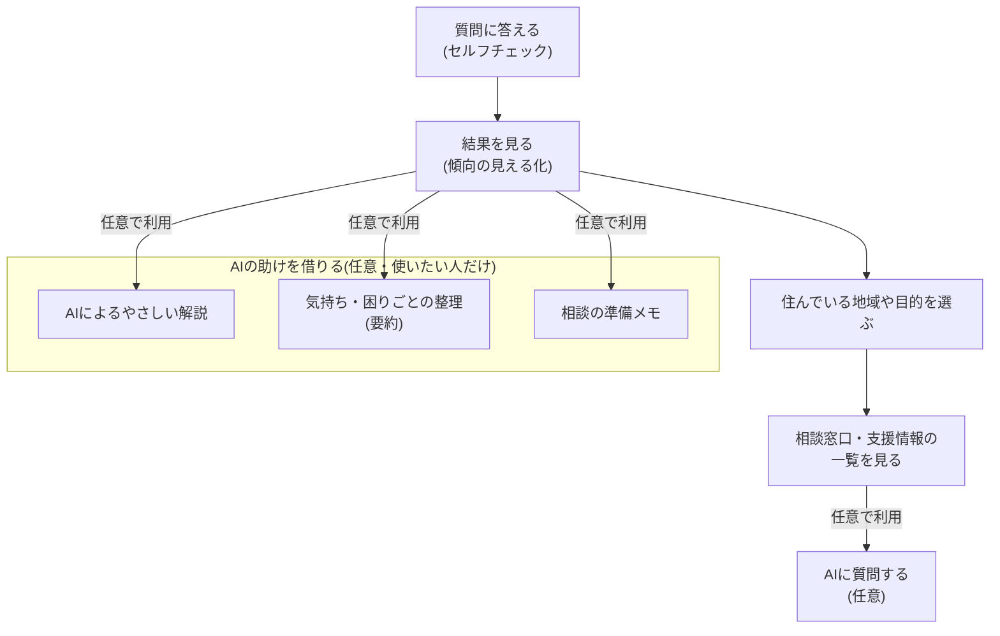
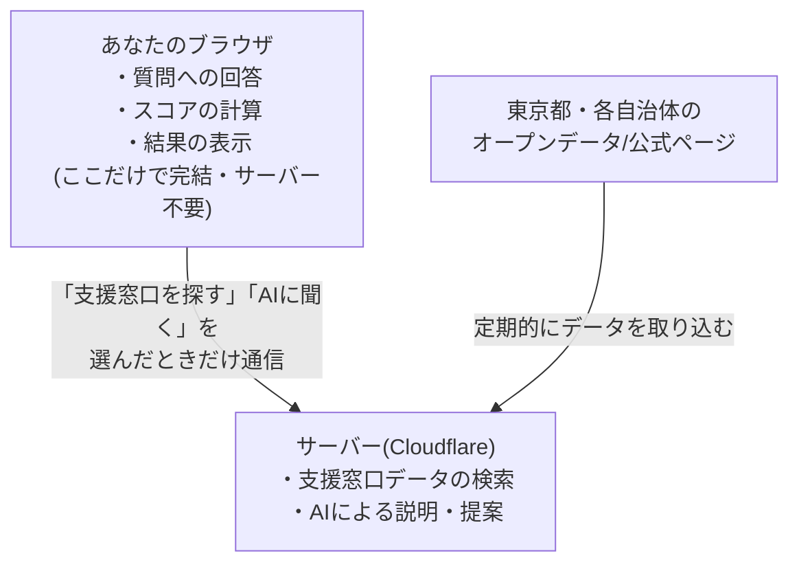

# Trait Compass のしくみ(技術の概要・非エンジニア向け)

このページは、プログラミングに詳しくない方向けに、Trait Compass がどんなアプリで、
裏側でどう動いているかをやさしく説明するものです。

## 1. このアプリは何をするもの?

発達特性(ADHDっぽさ・ASDっぽさ・感覚過敏など)や、日常の「困りごと」を整理して、
「自分の特性はこういう傾向がありそうだ」と気づくきっかけを作り、必要であれば
お住まいの地域の支援窓口・相談先を探せるようにするアプリです。

- 病院での診断の代わりにはなりません。あくまで「自己理解」と「相談先探し」の
  入り口として使うことを想定しています。
- 質問に答える → 結果を見る → (必要なら)近くの支援窓口を探す、という3ステップで
  完結します。

## 2. 3つの柱

### ① セルフチェック(質問に答える)
いくつかの質問に答えると、どんな傾向がどれくらい強く出ているかを、レーダーチャートなどで
見える化します。

### ② 支援情報検索
「小学生」「就労について相談したい」のように、年齢や困りごとの種類を選ぶと、東京都内の
自治体ごとの相談窓口・支援制度・学校の情報などを検索できます。

### ③ AIによる説明・提案(使うかどうかは選べます)
結果の意味をAIにやさしく説明してもらったり、状況に合う支援情報をAIに提案してもらったり
できます。この機能は明示的にオンにした場合のみ使われます(後述「プライバシーへの配慮」参照)。

## 3. 利用の流れ

実際に使う流れを図にすると、次のようになります。基本は「質問に答える→結果を見る→
(必要なら)支援情報を探す」というシンプルな流れで、AIを使った機能はすべて任意です。

## 4. プライバシーへの配慮を最優先にしています

- **質問への回答・スコアは、スマホやパソコンの中(ブラウザ)だけで処理されます。**
  サーバーに送信されることはありません。
- サーバーと通信するのは、「支援窓口を検索する」「AIに説明してもらう」など、
  利用者が明示的に選んだ機能を使うときだけです。
- アクセス解析も、Cookieを使わず、個人を特定できない形で「どの画面が何回表示されたか」
  という集計値のみを記録しています。回答内容・年齢・地域・IPアドレスなどは一切記録して
  いません。

## 5. 全体のしくみ(ざっくり図解)

## 6. 使っている技術(ざっくり紹介)

| 技術 | 何に使っているか | 選んだ理由(ざっくり) |
|---|---|---|
| Next.js | アプリの画面まわり全般 | Webアプリを作る定番の技術で、情報や実例が豊富 |
| Cloudflare Workers | サーバー部分の実行環境 | 個人開発でも無料枠で運用しやすく、応答が速い |
| Cloudflare D1 | 支援窓口データなどの保存先 | 小〜中規模のデータベースをCloudflare上で手軽に扱える |
| Cloudflare R2 | 画像などの保存先 | Cloudflare上で完結でき、コストを抑えやすい |
| AI(Gemini等) | 結果の説明・提案(オプトイン機能) | 複数のAIサービスを切り替えられる作りで特定の1社に依存しない |

## 7. データはどこから来ているか

支援窓口・学校情報などは、東京都のオープンデータカタログ(誰でも使える公開データ)や、
各自治体の公式ホームページをもとにしています。自治体ごとの個別調査データそのもの
(住所・電話番号などの実データ)は、このリポジトリでは非公開としています。
公開しているのはあくまでアプリの「しくみ」(プログラムのコード)です。

## 8. 開発の進め方

このプロジェクトは、開発者1名が AI エージェント(Claude Code)と協働しながら開発を
進めています。思いつきで作るのではなく、

1. 何を作るか・なぜ作るかを言葉で整理する(仕様)
2. 実装する
3. 自動テストで壊れていないか確認する

という順番を意識しています。「AIと一緒に、個人開発でもきちんとした作り方をするには
どうすればいいか」も、このプロジェクトのテーマの一つです。

エンジニア向けの詳しい設計資料としては、[architecture-for-engineers.md](./architecture-for-engineers.md)
と [data-pipelines-for-engineers.md](./data-pipelines-for-engineers.md) があります。

---

このドキュメントは今後、機能が増えるにつれて更新していく予定です。誤りや分かりにくい
点があれば Issue で教えてください。
